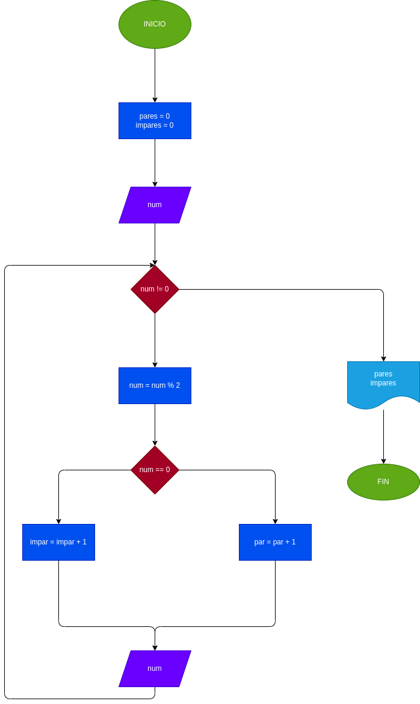

# REGISTRO CENTINELA 2
Hacer el diagrama de flujo y el programa en python, que lea numero enteros y positivos (uno en cada lectura), y que averigue e imprima cuantos son pares y cuantos son impares. para terminar usaremos el **registro centinela**, cuando el valor del numero leido sea cero.

## Análisis
Definicion de variables

pares = 0 ; inicia el conteo de numeros en cero.

impares = 0 ; inicia el conteo de numeros en cero.

el **registro centinela** tomara como digito el cero, cuando este sea digitado, el programa se detendra.

## Diagrama de flujo

